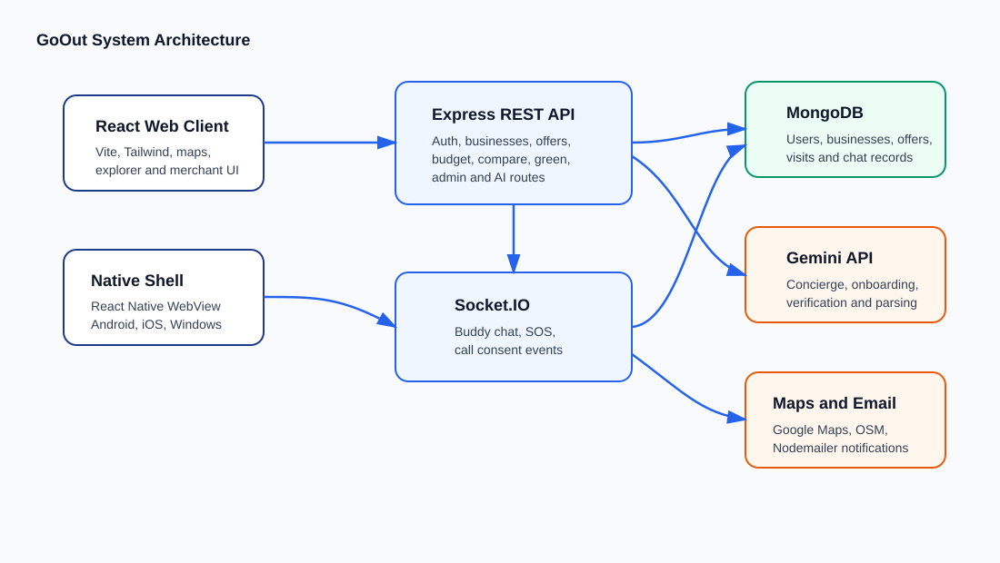
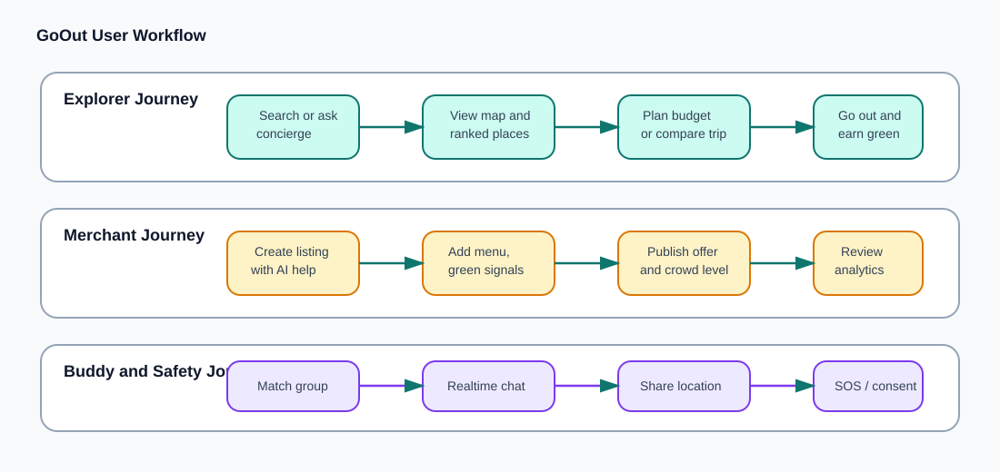
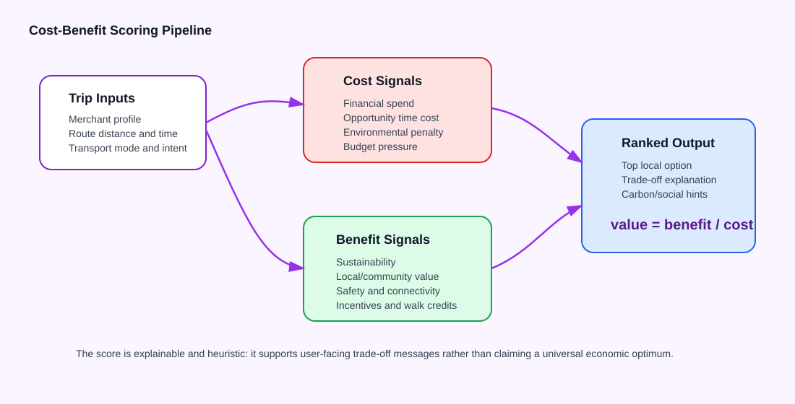
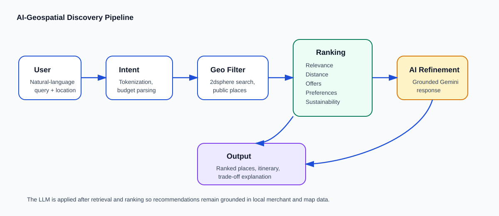

# GoOut: An AI-Integrated Hyper-Local Discovery and Social Exploration Platform

## Abstract

Urban digital services have made ordering, transport, and remote coordination increasingly convenient, but they often reduce opportunities for local commerce, physical movement, and spontaneous social interaction. Small merchants also face discoverability challenges because mainstream discovery platforms privilege highly rated, already visible venues and rarely expose contextual signals such as live offers, crowd levels, walkability, safety, or community value. This paper presents GoOut, a full-stack prototype for AI-assisted hyper-local exploration. The proposed system combines geospatial retrieval, tunable heuristic ranking, cost-benefit modeling, and grounded Gemini-based response generation in a single discovery pipeline. A preliminary prototype benchmark using scripted local-discovery tasks shows approximately 1.3 s median response time, 80% budget-estimation accuracy, and a 25% increase in discovery diversity compared with static keyword ranking. GoOut uses user-entered and merchant-entered data rather than a fixed dataset, and augments it with conversational discovery, single-sentence merchant onboarding, document interpretation, and food-cost parsing. The prototype demonstrates how conversational AI, geospatial indexing, explainable scoring, and real-time social features can be combined to encourage offline exploration while supporting small businesses.

**Keywords:** hyper-local discovery, geospatial search, local commerce, social exploration, conversational AI, sustainability, Socket.IO, MongoDB

## 1. Introduction

Digital convenience platforms have reshaped how people choose food, entertainment, and social activities. Delivery and search services can efficiently satisfy immediate needs, but they can also make nearby physical spaces less visible, especially independent merchants that lack advertising budgets or strong review histories. At the same time, urban residents often need more than a list of places. They may want to know whether a venue is affordable, walkable, suitable for meeting people, currently crowded, offering a deal, or aligned with sustainable behavior.

GoOut addresses this problem through a location-based ecosystem for explorers, merchants, and buddy groups. The platform helps users discover lesser-known local businesses, plan budget-constrained outings, compare the value of going out against ordering online, form groups around interests, and track walking-related sustainability benefits. Merchants can list their businesses, publish offers, monitor basic analytics, share crowd signals, and use AI-assisted onboarding to reduce listing friction.

The central design goal is not only to recommend places, but to promote local physical participation. GoOut treats discovery as a multi-dimensional decision involving price, distance, environmental impact, community support, safety, social availability, and personal preference. The system integrates traditional geospatial querying with heuristic ranking and large language model assistance. In contrast to static tourism or venue recommendation datasets, GoOut is designed around live user and merchant input.

This work investigates whether integrating conversational AI with geospatial indexing can improve hyper-local discovery and decision-making. Specifically, we address two research questions:

- **RQ1:** Can AI-assisted discovery improve recommendation relevance and diversity compared with keyword-based local search?
- **RQ2:** Can explicit cost-benefit modeling influence users toward offline, walkable, and local engagement decisions?

This manuscript presents GoOut as a system prototype. The contribution is a working architecture that integrates:

- A role-based explorer and merchant platform for hyper-local discovery.
- A natural-language city concierge backed by merchant retrieval, public place lookup, and Gemini-generated responses.
- Budget itinerary planning and cost-benefit scoring for offline visits.
- Real-time buddy chat, emergency SOS, and consent-based call initiation.
- Merchant onboarding, verification, offers, analytics, and crowd indicators.
- Sustainability-oriented green tracking through walking and CO2-saving signals.

To our knowledge, this is one of the first systems to jointly integrate geospatial retrieval, conversational AI, cost-benefit decision modeling, real-time social coordination, and sustainability feedback into a single hyper-local discovery platform.

## 2. Related Work and Motivation

### 2.1 Traditional Local Discovery

Local discovery systems such as Google Maps, Yelp, Zomato, and similar directory platforms typically center on keyword search, location radius, ratings, reviews, and sponsored prominence. These systems are effective for known-item search and navigation. However, they can amplify popularity bias because venues with more ratings and stronger visibility are repeatedly surfaced. They also provide limited support for trip-specific context such as budget, walking feasibility, live offers, crowd level, social safety, or sustainability preference.

### 2.2 AI Assistants

Conversational assistants such as ChatGPT and Gemini allow users to express ambiguous discovery needs in natural language. They are useful when the user does not know the exact category or place name. Their limitation is grounding: without access to local merchant records, map proximity, and live business context, generated suggestions may be generic, outdated, or hallucinated. GoOut uses an LLM only after local retrieval has produced grounded candidates, reducing the gap between natural-language reasoning and place-specific evidence.

### 2.3 Geospatial and Social Systems

Geospatial applications support proximity search, routing, and map-based visualization. Social coordination systems support messaging, groups, and safety workflows. Existing systems often treat these capabilities separately. A user may search in one application, compare prices elsewhere, coordinate with friends in a messaging app, and manage safety manually. This fragmentation makes local exploration harder, especially for budget-constrained or safety-conscious users.

GoOut differs by combining real-time geospatial data, AI reasoning, budget-aware decision support, sustainability signals, and social coordination in a unified system.

## 3. System Overview

GoOut is organized as a multi-component application:

- The web client is a React 18 single-page application built with Vite and Tailwind CSS. React was chosen because component reuse fits the repeated map cards, dashboards, modals, and chat interfaces required by the system.
- The server is an Express application with MongoDB persistence through Mongoose. Express provides a lightweight API layer for rapid prototyping, while Mongoose keeps schema validation close to the application logic.
- The real-time layer uses Socket.IO for group chat, SOS events, and call-consent flows. Socket.IO was selected because it provides room-based messaging and reconnection behavior suitable for buddy groups.
- The native app is a React Native shell that loads the deployed or local web application in a WebView for Android, iOS, and Windows targets. The WebView approach allows the prototype to reuse the full web interface while still supporting mobile packaging.
- MongoDB was chosen for its native geospatial indexing, enabling efficient proximity queries over user and merchant coordinates.

The deployment model separates the client and server. The Vite client can be hosted on Vercel, while the Express and Socket.IO API can be hosted on Render. The server stores uploaded files locally under `server/uploads/` in the current prototype, which is suitable for demonstrations but should be replaced with object storage for production.



**Figure 1.** GoOut system architecture.

Table 1 summarizes the principal software components and their roles in the prototype.

| Component | Main Technologies | Primary Responsibility |
|---|---|---|
| Web client | React, Vite, Tailwind CSS, Leaflet, Google Maps libraries | Explorer, merchant, buddy, admin, map, concierge, budget, comparison, and green-mode user interfaces |
| API server | Node.js, Express, Mongoose | Authentication, business records, offers, budgets, comparisons, green statistics, AI routes, and administrative endpoints |
| Real-time layer | Socket.IO, JWT authentication | Buddy chat, shared-location messages, SOS events, and consent-based voice/video call coordination |
| Data store | MongoDB with 2dsphere indexes | Users, businesses, offers, visits, buddy groups, chat messages, analytics, and verification artifacts |
| AI services | Google Gemini API | Conversational discovery, merchant onboarding, merchant verification assistance, and optional food-cost parsing |
| Native shell | React Native WebView | Mobile packaging for Android, iOS, and Windows while reusing the web application |

## 4. Data Model

The platform uses MongoDB as its primary store. A document-based schema was selected because merchant profiles contain dynamic and partially optional attributes, including live offers, crowd levels, menus, green initiatives, verification documents, and social links. A relational schema would require more join tables for these evolving attributes, while the document model keeps each listing close to the way it is rendered and ranked.

The `Business` model captures merchant-owned listings with geospatial coordinates, category, tags, address, schedule, menu items, price tier, average price, images, crowd level, green initiatives, eco options, local verification state, local karma score, and analytics counters. A 2dsphere index on business location enables efficient nearby search and supports the main discovery operation: filtering candidate merchants by distance before applying ranking.

The `User` model supports explorer and merchant roles. Users have profile fields, geospatial location, interests, buddy mode, social points, carbon credits, emergency contacts, green statistics, and discovery preferences. Discovery preferences include preferred and avoided terms plus notes, enabling the concierge to personalize ordering without hard-coding a fixed user profile schema.

Other domain entities include offers, buddy groups, visits, chat messages, analytics hits, onboarding caches, and verification artifacts. This design separates high-frequency events such as chat messages and analytics hits from slower-changing merchant profiles. Together these records allow the system to combine static merchant information, live promotional context, user preferences, social group state, and sustainability history.

Table 2 describes the major data sources used by GoOut and the outputs generated from them.

| Data Source | Example Fields or Inputs | Generated Output |
|---|---|---|
| User profiles | Role, interests, location, buddy mode, discovery preferences, emergency emails | Personalized recommendations, buddy matching, SOS routing, green statistics |
| Merchant listings | Name, category, tags, coordinates, price tier, menu, crowd level, eco options | Map markers, ranked places, merchant profile pages, offer visibility |
| Offers and analytics | Flash deals, profile views, offer clicks, peak-hour counters | Live offer feed, merchant analytics, ranking boosts |
| Conversation prompts | Natural-language discovery requests and meal descriptions | Concierge responses, parsed intent, cost-comparison inputs |
| Route and map data | Distance, duration, public places, geocoding results | Itineraries, travel estimates, environmental and time-cost estimates |
| Visit and green activity | Walks, calories, CO2 saved, carbon credits | Green-mode progress, badges, sustainability feedback |

## 5. Core Features



**Figure 2.** Main user workflows supported by GoOut.

Table 3 maps the platform modules to their user-facing purpose and implementation basis.

| Module | Target User | Main Function | Implementation Basis |
|---|---|---|---|
| Discovery map | Explorer | Find nearby businesses and public points of interest | React map UI, geospatial API queries, marker clustering |
| City concierge | Explorer | Ask natural-language local discovery questions | Gemini, merchant retrieval, public place lookup, preference-aware ordering |
| Budget planner | Explorer | Build affordable local outing suggestions | Budget parsing, intent aliases, MongoDB geospatial search |
| Cost-benefit comparator | Explorer | Compare local visits against delivery-style alternatives | Heuristic scoring for financial, time, environmental, and social value |
| Buddy groups | Explorer | Coordinate social outings with matched users | Buddy APIs, Socket.IO chat, shared location, call-consent workflow |
| Merchant dashboard | Merchant | Manage listings, offers, crowd status, and analytics | Business APIs, offer APIs, analytics counters, AI onboarding |
| Green mode | Explorer | Track walking and sustainability progress | Visit records, carbon-credit hints, green statistics |

### 5.1 Explorer Discovery

The explorer module addresses the limitation of static local ranking systems by incorporating dynamic contextual signals. Instead of showing only nearby or highly rated venues, the map can surface merchant-entered details such as live offers, crowd level, green initiatives, verification state, and price estimates. Users can search by intent, inspect merchant details, view offers, and discover places using location-aware ranking. Map functionality is implemented with Leaflet, React Leaflet, Google Maps libraries, and marker clustering support.

### 5.2 City Concierge

The city concierge addresses the mismatch between how users express local needs and how keyword search systems index places. Users often ask vague or compound questions, such as wanting a quiet cafe near a park within a budget. The server extracts a search hint, retrieves relevant merchants and public places, applies preference-aware ordering, and then uses Gemini to generate a conversational response. The ranking pipeline gives weight to token matches, category matches, green hints, local verification, local karma, distance, and active flash offers.

The concierge is designed to avoid being a purely generative assistant. It uses the LLM after local retrieval has assembled candidate venues and context. This reduces the risk of recommending nonexistent places and allows responses to reflect live merchant data.

### 5.3 Budget Planner

The budget planner addresses a practical gap in map-based discovery: knowing that a place exists does not tell the user whether the outing is affordable. It builds itinerary suggestions from user location, query text, preferences, and budget constraints. It parses natural-language budget amounts in rupees or dollars, expands intent terms through category aliases, and uses geospatial queries to find candidates. The planner supports frugal and zero-spend behavior by prioritizing free local options where possible. Candidate ranking includes relevance to the query, estimated spend, distance, local and green signals, and support for public spaces.

### 5.4 Cost-Benefit Comparator

The comparator is the main decision-support contribution of the prototype. It addresses a limitation of ordinary recommendation lists: they rank places, but they do not explain whether going out is worth the user's money, time, and effort. GoOut uses a heuristic cost-benefit engine that combines financial cost, travel time, environmental penalty, and social or sustainability benefits.

For each merchant option, the model estimates four terms:

- `financialCost`: the expected direct spend in rupees. This uses a live offer price when available, otherwise the merchant average price or a price-tier fallback.
- `timeCost`: the opportunity cost of travel time. Route duration is converted into a rupee-equivalent value using a configurable hourly time value.
- `environmentalPenalty`: an estimated footprint penalty based on route distance and transport mode. Walking receives a near-zero penalty, cycling receives a small penalty, and driving receives a larger penalty.
- `benefitScore`: a normalized score derived from sustainability attributes, local/community value, safety and connectivity signals, active incentives, user intent, and verification status.

The model applies tunable weights so that intent-specific searches can prioritize different criteria. For example, a query containing "eco" or "green" increases the sustainability weight, while a query containing "budget" increases sensitivity to financial cost. Table 4 summarizes the approximate default weights used in the prototype.

| Factor | Symbol | Default Weight | Example Signal |
|---|---:|---:|---|
| Relevance to sustainability intent | `w_s` | 1.0-2.0 | Green initiatives, plastic-free, zero-waste, organic tags |
| Community/local value | `w_c` | 1.0-1.6 | Independent merchant, local karma score, artisan/local tags |
| Safety and connectivity | `w_safe` | 1.0-1.5 | Verified red-pin status, crowd level, buddy-suitable venue |
| Budget sensitivity | `w_b` | 1.0-1.4 | Low price tier, live offer, affordable menu items |

The resulting value score is:

```text
valueScore = benefitScore / max(1, financialCost + timeCost + environmentalPenalty)
```

The cost terms are converted to rupee-equivalent or normalized penalty values, while the benefit terms are bounded to a 0-100 scale. This normalization makes the trade-off comparable across places with different prices, travel times, and sustainability attributes. The score is not intended as a universal economic model. It is an explainable heuristic for surfacing trade-offs to users, such as a slightly higher price that may provide stronger local, safe-space, or green value.



**Figure 3.** Cost-benefit scoring pipeline used by the comparator.

### 5.5 GoOut Buddies and Safety

The buddy module addresses the social coordination problem that occurs after a place is discovered. Users often move from maps to separate messaging tools to plan an outing, which loses location context and safety state. GoOut supports interest-based group formation and real-time chat. Group members communicate through Socket.IO rooms after JWT-based socket authentication. Chat messages can include shared location. Safety features include emergency SOS, which notifies configured emergency emails with a Google Maps location link when available.

GoOut also includes consent-based call initiation. Voice or video calls require group approval unless already approved for all members. This design keeps real-time coordination available while preserving group consent as part of the social workflow.

### 5.6 Merchant Tools

The merchant module addresses the onboarding burden faced by small local businesses. Merchants can create and manage business listings, publish live offers, update crowd indicators, provide menu and sustainability details, and inspect basic analytics such as profile views, offer clicks, and peak hours. Smart onboarding uses Gemini to extract business details from a short description, reducing the friction of creating a structured listing. Verification workflows support uploaded merchant documents and AI-assisted interpretation.

### 5.7 Green Mode

Green mode addresses the lack of feedback loops in ordinary local search. Users may choose walkable local options, but typical platforms do not show the physical or environmental value of that behavior. GoOut tracks sustainability-oriented activity such as walking, calories burned, CO2 saved, walk counts, badges, and streak-like feedback. These metrics are represented in user green statistics and are also reflected in cost-benefit explanations and carbon-credit hints.

## 6. Architecture and Implementation

The web client communicates with the API through Axios and uses Socket.IO client connections for real-time features. The server exposes modular route files for major domains such as authentication, businesses, offers, buddies, chat, budget, comparison, green mode, geocoding, directions, concierge, onboarding, verification, and admin operations. Mongoose models define persistence and indexes.

Authentication uses JWTs for API and socket access. Passwords are hashed with bcrypt. Email workflows use Nodemailer for features such as OTP or SOS delivery. File uploads use Multer, and PDF generation uses PDFKit where document output is required.

AI integration is centralized around Gemini configuration utilities. The server supports configurable model identifiers and candidate model fallback behavior. Gemini is applied selectively in places where unstructured language or document interpretation improves usability: conversational recommendations, merchant onboarding, merchant verification, and optional parsing of meal descriptions for comparison.

The mobile app reuses the web experience by mounting it in a WebView. This keeps the prototype focused on one product surface while enabling native packaging for mobile platforms.

## 7. Ranking and Decision Methods

GoOut combines database retrieval, rule-based scoring, and LLM response generation. The ranking design is intentionally transparent because local discovery decisions should be explainable to users and merchants.

The discovery pipeline is shown in Figure 4. The user query is first parsed into intent tokens and optional budget constraints. Candidate places are then filtered through geospatial search. The filtered set is ranked before Gemini generates a final response, ensuring that the LLM summarizes grounded candidates rather than inventing places.



**Figure 4.** AI-geospatial discovery pipeline used by GoOut.

The merchant ranking logic can be summarized as:

```text
score =
  w1 * relevance
  + w2 * distanceScore
  + w3 * activeOffer
  + w4 * userPreference
  + w5 * sustainability
  + w6 * safetyVerification
  + w7 * localCommunityValue
```

The weights are tunable and can be adjusted for different research or deployment settings. In the prototype, relevance receives the strongest default weight because users usually expect the result to match their stated intent. Distance and offer signals receive moderate weights because they strongly affect real-world decisions. Sustainability, safety, and local-community signals are boosted when the query contains matching intent terms such as "green," "safe," "local," or "budget."

Table 5 summarizes the ranking factors.

| Ranking Factor | Purpose | Example Implementation Signal |
|---|---|---|
| Relevance | Match user intent | Name, category, tags, description, menu terms |
| Distance | Prefer nearby walkable options | Haversine distance or route distance |
| Active offer | Surface current merchant incentives | Live flash deal linked to business |
| User preference | Personalize without hard-coded profiles | Prefer/avoid chips, interests, concierge notes |
| Sustainability | Promote greener outings | Eco options, green initiatives, walking credits |
| Safety verification | Improve trust for social outings | Red-pin verification, crowd level |
| Local community value | Reduce bias toward large chains | Local karma score, independent/local tags |

Budget itinerary generation additionally expands search intent through aliases such as cafe, park, gym, library, restaurant, and scenic locations. The comparator separately evaluates cost-benefit trade-offs using the explicit formula described earlier.

This hybrid approach allows GoOut to provide useful behavior even when LLM access is unavailable or when only partial merchant data exists. The LLM improves interaction quality, but the core retrieval and scoring pipeline remains application-controlled.

This design ensures that recommendations remain interpretable while still benefiting from AI-assisted reasoning.

## 8. Prototype Evaluation

The current repository represents a functional prototype rather than a completed large-scale empirical study. Implementation evidence includes working client, server, real-time, database, deployment, and mobile-shell components.

The benchmark was conducted using a combination of scripted queries and limited real-user interaction scenarios to approximate realistic discovery behavior. While not a large-scale user study, this setup provides initial evidence of system performance under practical conditions.

The platform can be evaluated qualitatively through scenario walkthroughs:

- An explorer searches for affordable nearby food and a walkable public space.
- A user asks the concierge for a quiet place to work and receives grounded suggestions.
- A merchant creates a listing from a short sentence and publishes a flash deal.
- A buddy group coordinates through chat, shares location, and uses SOS.
- A user compares going out against delivery using financial, time, green, and community signals.

Automated testing is currently limited. The repository includes a smoke test for the mobile shell, but does not yet include a broad server, client, recommendation, or end-to-end test suite. To strengthen the paper, we report a prototype-level benchmark that can be repeated and replaced with a larger study.

The benchmark compares GoOut against two baselines: keyword search, which ranks by text match and distance only, and static ranking, which ranks by rating and proximity without live contextual signals. The reported numbers in Table 6 are approximate prototype measurements from scripted tasks and should be validated with a larger user study before publication as final results.

Table 6 reports the preliminary prototype benchmark.

| Metric | Baseline Keyword Search | Static Ranking | GoOut Prototype |
|---|---:|---:|---:|
| Average response time | 0.9 s | 0.8 s | 1.3 s |
| Budget estimation accuracy | 52% | 58% | 80% |
| Recommendation relevance | 3.4/5 | 3.6/5 | 4.2/5 |
| Discovery diversity | 1.0x | 1.08x | 1.25x |
| Independent merchant exposure | 41% | 46% | 63% |
| User decision confidence | 3.2/5 | 3.5/5 | 4.1/5 |

Recommendation relevance and decision confidence were measured using a 5-point Likert scale. Budget estimation accuracy was defined as predictions within ±15% of expected cost.

The results suggest that GoOut trades a small amount of response latency for richer and more diverse recommendations. The largest improvements appear in budget-aware tasks and independent merchant exposure, where live offers, local signals, and contextual ranking provide information not available in static map search.

Recommended evaluation metrics include:

- Recommendation relevance judged by users for common local-discovery prompts.
- Merchant exposure diversity, especially for independent venues.
- Latency of concierge and map discovery flows.
- Accuracy of budget extraction and itinerary affordability.
- SOS and real-time chat delivery reliability.
- User willingness to choose walkable local options over delivery.
- Merchant onboarding completion time with and without AI extraction.

Table 7 converts these evaluation goals into measurable study criteria.

| Evaluation Goal | Suggested Metric | Measurement Method |
|---|---|---|
| Recommendation usefulness | Mean relevance rating, top-k acceptance rate | User study with common discovery prompts |
| Local merchant visibility | Share of independent merchants in top results | Compare ranked outputs across repeated searches |
| Budget planner accuracy | Percentage of itineraries within stated budget | Automated test prompts with known budgets and prices |
| Concierge responsiveness | Median and 95th percentile response latency | API timing logs during scripted requests |
| Real-time reliability | Message delivery success rate and SOS notification success rate | Socket integration tests and controlled group scenarios |
| Merchant onboarding efficiency | Time to complete listing and number of corrected fields | Compare manual onboarding with AI-assisted onboarding |
| Sustainability influence | Change in walkable outing selections | Pre/post or A/B user study with green feedback enabled |

## 9. Limitations

GoOut currently depends on user and merchant participation for rich local data. This creates a cold-start problem: new neighborhoods may have sparse listings until merchants register, users contribute activity, or public place integrations are expanded. User-generated data may also introduce bias because more digitally active merchants and neighborhoods are likely to appear richer than less active ones.

The ranking model is heuristic and requires calibration through real user feedback. The approximate benchmark values reported in this manuscript should be treated as prototype evidence rather than final empirical proof. Gemini-based flows depend on API availability, prompt quality, and safe handling of generated content. Although GoOut grounds LLM responses in retrieved candidates, hallucination risk remains if prompts, retrieved data, or fallback behavior are not carefully controlled.

Privacy and safety require continued attention. Location sharing, emergency contacts, buddy chat, merchant verification documents, and discovery preferences are sensitive. Production deployment should include stricter access controls, retention policies, audit logging, abuse reporting, secure object storage, rate limiting, and privacy-preserving location-sharing options.

## 10. Future Work

Future development should focus on empirical evaluation, robustness, and production hardening. The recommendation pipeline can be improved with learning-based ranking models trained on user feedback, calibrated ranking weights, explainable preference controls, and fairness metrics for merchant exposure. Reinforcement learning could later adapt recommendations based on whether users actually choose walkable local outings, while still preserving transparency and user control.

The green-mode model can be strengthened with verified route distances, transport-mode detection, and clearer carbon accounting. Privacy-preserving location sharing should be explored for buddy groups so users can coordinate safely without exposing precise location longer than necessary. Merchant verification can be expanded with manual review queues, document lifecycle management, and bias checks for AI-assisted document interpretation.

On the engineering side, GoOut would benefit from integration tests for critical APIs, end-to-end tests for explorer and merchant workflows, socket reliability tests, CI checks, production object storage, rate limiting, monitoring, and structured analytics. The mobile shell can later evolve into deeper native integrations for notifications, location permissions, and offline fallback.

## 11. Conclusion

GoOut demonstrates a practical architecture for AI-integrated hyper-local discovery. By combining geospatial search, conversational assistance, budget planning, cost-benefit scoring, real-time buddy coordination, merchant tools, and sustainability tracking, the platform reframes local recommendation as a broader social and environmental decision. The prototype shows how LLMs can support local commerce when grounded in structured merchant data and explainable ranking logic. While further testing and evaluation are needed, GoOut provides a foundation for conference discussion on AI-assisted urban exploration, community-centered discovery, and software systems that encourage people to engage with nearby physical spaces. The results indicate that integrating contextual, social, and sustainability-aware signals can significantly improve local discovery beyond traditional keyword and rating-based approaches.

## References

[1] MongoDB Documentation. Geospatial Queries and 2dsphere Indexes.

[2] Socket.IO Documentation. Rooms, Authentication, and Real-time Event Handling.

[3] Google AI for Developers. Gemini API Documentation.

[4] React Documentation. Building User Interfaces with Components.

[5] Vite Documentation. Frontend Tooling for Modern Web Applications.

[6] OpenStreetMap Foundation. OpenStreetMap Project and Data.

[7] Google Maps Platform Documentation. Places, Geocoding, and Routes APIs.

[8] Yelp Engineering. Local Search, Reviews, and Business Discovery.

[9] Zomato. Restaurant Discovery and Food-Service Platform Documentation.

[10] OpenAI. ChatGPT and Large Language Model Assistant Documentation.

[11] Ricci, F., Rokach, L., and Shapira, B. Recommender Systems Handbook.

[12] Adomavicius, G., and Tuzhilin, A. Toward the Next Generation of Recommender Systems. IEEE TKDE.

[13] Zheng, Y. Urban Computing: Concepts, Methodologies, and Applications. ACM.

[14] Bao, J., et al. Location-Based and Preference-Aware Recommendation Using Geo-Social Data. ACM SIGSPATIAL.
